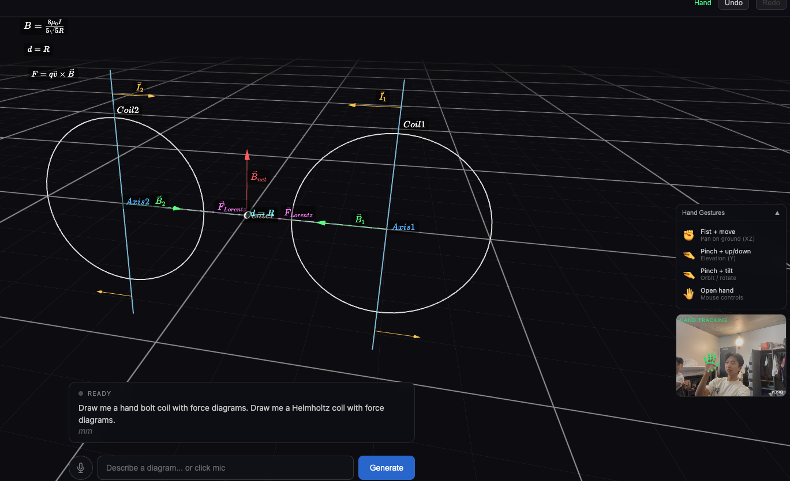

# Speech-to-Diagram

Generate interactive 3D math and physics diagrams using voice. Speak a description, and Claude converts it into a rendered diagram with vectors, curves, equations, and more — all controllable via hand gestures.

[Live Demo](https://diagram-production-df57.up.railway.app)



## How It Works

1. **Speak** a description ("draw a free body diagram with gravity and normal force")
2. **ElevenLabs Scribe** transcribes your speech in real-time
3. **Claude** converts the transcript into a structured DiagramSpec JSON
4. **Three.js** renders the diagram as an interactive 3D scene
5. **MediaPipe** tracks your hand gestures to control the camera

## Hand Gesture Controls

| Gesture | Action |
|---------|--------|
| Fist | Pan across the XZ plane |
| Pinch | Adjust elevation + orbit rotation |
| Open hand | Default mouse/trackpad controls |

## Supported Diagram Objects

Points, vectors, lines, circles, arcs, equations (KaTeX/LaTeX), planes, curves, vector fields, angles, and axes — with a color palette optimized for dark backgrounds.

## Tech Stack

| Layer | Technology |
|-------|-----------|
| Frontend | React, Three.js, React Three Fiber, Zustand |
| 3D Utilities | drei (Grid, OrbitControls, Html, Line) |
| Hand Tracking | MediaPipe Vision Tasks |
| Math Rendering | KaTeX |
| Speech-to-Text | ElevenLabs Scribe v2 (real-time WebSocket) |
| Diagram Generation | Anthropic Claude Sonnet 4 |
| Backend | Node.js, Express, WebSocket |
| Deployment | Railway |

## MCP Server

The app exposes an MCP (Model Context Protocol) endpoint at `/mcp`, allowing AI clients like ChatGPT or Claude Desktop to generate diagrams programmatically.

**Tool:** `generate_diagram` — takes a natural language description and returns a DiagramSpec JSON.

### ChatGPT Integration

Add as a connector in ChatGPT (requires Developer Mode on a paid plan):
- **Settings > Apps & Connectors > Connectors > Create**
- **URL:** `https://diagram-production-df57.up.railway.app/mcp`
- **Auth:** None

### Claude Desktop (stdio)

```json
{
  "mcpServers": {
    "speech-to-diagram": {
      "command": "npx",
      "args": ["tsx", "mcp-stdio.ts"],
      "cwd": "/path/to/Diagram/server"
    }
  }
}
```

## Local Development

```bash
# Install dependencies
cd client && npm install
cd ../server && npm install

# Start both servers
./dev.sh
```

- Client: `http://localhost:5173`
- Server: `http://localhost:3002`

### Environment Variables

Create a `.env` file in the project root:

```
ANTHROPIC_API_KEY=sk-ant-...
ELEVENLABS_API_KEY=sk_...
```

## Deployment (Railway)

The `mcp` branch is configured for Railway deployment:

- **Build:** `cd client && npm install && npm run build && cd ../server && npm install`
- **Start:** `cd server && npm start`
- **Env vars:** `ANTHROPIC_API_KEY`, `ELEVENLABS_API_KEY`
